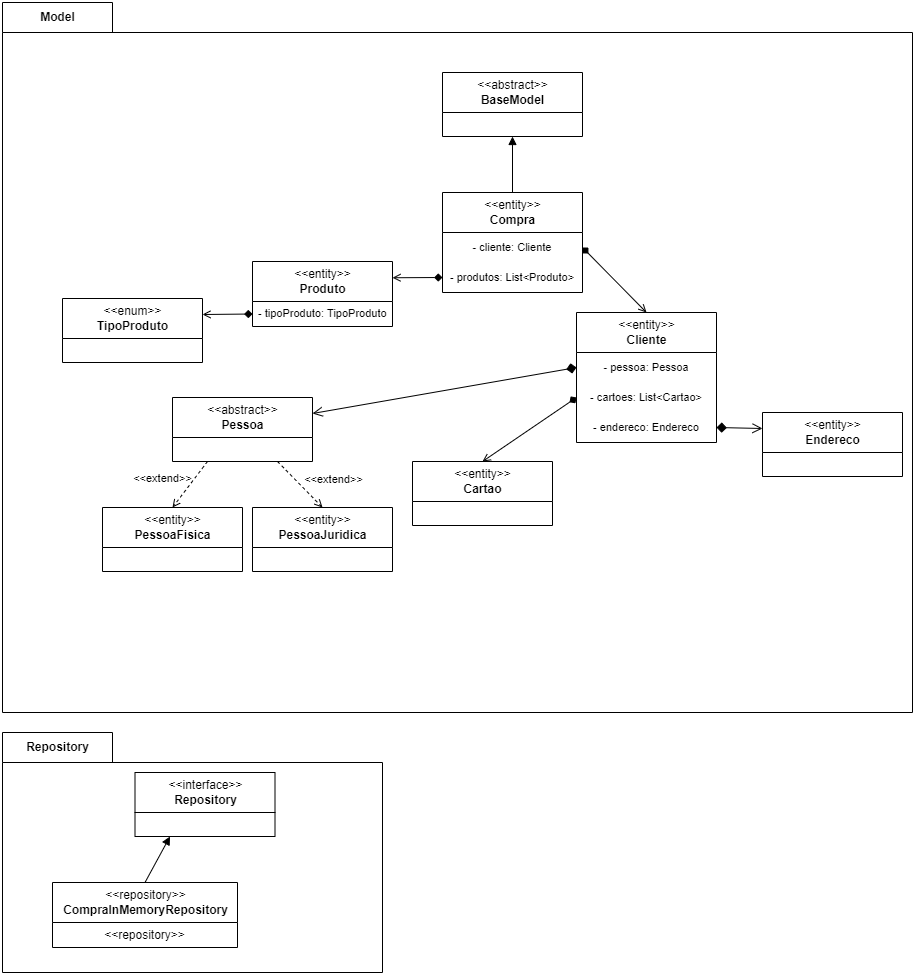

# Relatório da arquitetura

### Model 
 - O cliente pode ser model.PessoaFisica ou model.PessoaJuridica

### Service
 - Criar um método para listar os itens no carrinho (Produto, Quantidade, Preço Unitário e Total por item)
 - Criar um método para adicionar um item no carrinho.
 - Criar um método para remover um item do carrinho.
 - Criar um método para alterar a quantidade de um item do carrinho.
 - Calcular o total a pagar do carrinho de compras.
 - Prever o desconto no momento de calcular o total da compra.
 - Ao adicionar um novo produto verificar se o produto já existe, se existir atualizar apenas a quantidade.

## Design Patterns
### Strategy
 - Apenas para alguns produtos prever a cobrança de uma taxa extra a ser adicionado no valor total da compra.
 - Apenas para alguns produtos prever a cobrança de frete (pode ser valor fixo ou porcentagem).
 - Criar promoção para tipo de produto. 

### Repository
 - Criar classes de repository para manipulação e armazenamento dos dados (CRUD).
 - Ao iniciar o programa verificar de onde recuperar os dados dos produtos, ter a opção de buscar os itens 
    fixos na memória ou de uma outra fonte de dados (esta outra fonte de dados não precisa ser implementada
    , apenas simulada).

## Conceitos de Orientação a Objeto
### Herança
Pode-se observar a aplicação da herança nas classes de Pessoa Física e Pessoa Jurídica que herdam seus atributos da classe Pessoa.

### Interfaces
Utiliza-se do conceito de interfaces para definir comportamentos comuns para partes do código. O uso pode ser visto em alguns pacotes
como o de validações, o de cálculo de acréscimos e descontos de produtos e no pacote do repositório.

### Polimorfismo
Observa-se o uso de polimorfismos na sobrescrita de métodos na classe Pessoa e suas filhas, bem como nos métodos de cálculo
para aplicação de descontos e bônus.

### Collections
Na implementação do nosso projeto foram utilizadas duas Collections java: ArrayList e List. 
.

### Generics
A utilização de generics pode ser observada na implementação do BaseRepository, na carteira de cartões do cliente,

### SOLID

#### Single Responsability Principle
Foi tido atenção ao princípio de responsabilidade única durante a modelagem e a implementação do projeto,
de forma que se pode observar a definição das responsabilidades na separação dos pacotes da solução, assim como
na estruturação na relação e interfaceamento entre as classes do modelo e diferentes serviços.

#### Open-Closed Principle
O princípio de Aberto-Fechado pode ser visto na implementação do package Strategy visando novos tipos
de acréscimos e descontos aos produtos, também na lista de validações que são empregadas em algumas definições de métodos
ou, finalmente, no pacote repository e outros meios de persistência diferentes

## Diagrama de pacotes

